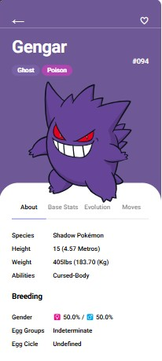
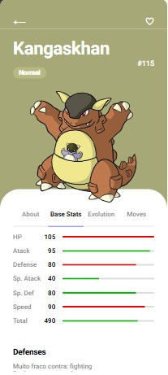

# 📖 Projeto: Pokedex com API REST da PokeAPI

Este projeto foi desenvolvido para fins didáticos, como parte do [Bootcamp da DIO, em parceria com a Ri Happy](https://www.dio.me/bootcamp/coding-future-front-end-do-zero), com foco no desenvolvimento front-end. A aplicação permite a visualização detalhadas de Pokemon, consumindo a [PokeAPI](http://pokeapi.co/) para exibição dinâmica dos dados. 

### 👀 Se quiser ver o resultado, o deploy do projeto está no GitHub, na página: [index.html](http://127.0.0.1:5500/index.html)

 O designer da aplicação teve como base o projeto publicado no [Dribbble](https://dribbble.com/shots/6540871-Pokedex-App) pelo autor Saepul Nahwan.

# 🚀 Funcionalidades
- 📌Listagem de Pokémon com informações básicas.
- 🔍Página com informações detalhadas para cada Pokémon.
- 🌐 Consumo de API REST com JavaScript puro.
- 📱 Interface responsiva e interativa.

 

## 📌 Tecnologias utilizadas
        

## 📚 Conceitos adquiridos

- **Consumo de API REST**: Utilização da [PokeAPI](http://pokeapi.co/) para obter dados dinâmicos sobre os Pokémon, implementando requisições assíncronas coma API `fetch()`.
- **Manipulação do DOM**: Uso de JavaScript para manipular dinamicamente os elementos do HTML.
- **Eventos e Interatividade**: Implementação de eventos `addEventListener()` para interagir com ações do usuário.
- **Estruturação HTML**: Construção da interface respeitando boas práticas de semântica.
- **CSS**: Estilização responsiva para diferentes dispositivos com o `@media screen`. Efeito de animação dinâmica com `@keyframes` internos e JavaScript.
- **JavaScript**: Organização do código separando responsabilidades em diferentes arquivos para melhor manutenção e reutilização.
- **Async/Await e Promises**: Uso de requisições HTTP assíncrona em funções para a visualização correta dos dados da API.
- **Versionamento do Projeto**: Controle de versões do projeto com o uso do Git/GitHub.

O resultado final foi a oportunidade de adquirir e consolidar meus conhecimentos, com destaque na relação ao consumo da API REST. O principal desafio foi consumir as informações da PokeAPI e conseguir atualizar dinâmicamente os dados do pokemon. Durante o processo de requisições HTTP com o `fetch()`, tive que lidar com diversos erros que me fizeram pesquisar bastante permitindo aprimorar meus conhecimentos.

## 📷 Capturas de Tela

      

## 🛠 Como Executar o Projeto

1. Clone o repositório: `git clone https://github.com/rgr147/pokedex.git`

3. Acesse a pasta do projeto: `cd pokedex`

4. Abra o arquivo `index.html` no navegador.

## 🤝 Contribuindo com o Projeto

Quer sugerir melhorias ou corrigir algo? Faça um fork do repositório e envie um pull request!

###Como contribuir:###

1. Faça um fork do repositório.
   
2. Clone o repositório forkado para o seu ambiente local: `git clone https://github.com/rgr147/pokedex.git`

3. Crie uma nova branch para suas alterações: `git checkout -b minha-sugestao`

4. Faça as modificações e commit: `git commit -m "Melhoria ou correção a sugerir"`

5. Envie para seu repositório remoto: `git push origin minha-sugestao`

6. Abra um pull request no repositório original.

Toda sugestão é bem-vinda! Vamos trocar conhecimentos e melhorar juntos. 🚀

## 🖌 Créditos ao Design

 O designer da aplicação teve como base o projeto do autor Saepul Nahwan publicado no [Dribbble](https://dribbble.com/shots/6540871-Pokedex-App). Todas as funcionalidades e adaptações foram implementadas com base no aprendizado do bootcamp.

## 📜 Licença
Este projeto foi desenvolvido para fins educacionais e não possui fins lucrativos.
